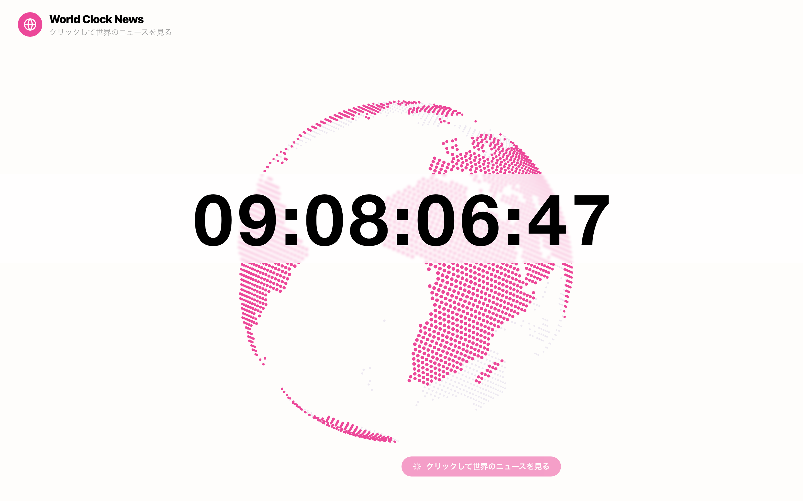

# 🌍 World Clock News

> 世界の今を、バブルで感じる。

リアルタイム時計を中心に、世界各地のニュースがバブルとなって飛び出すインタラクティブなダッシュボードです。




**🌐 ライブデモ: [time.1qaz.jp](https://time.1qaz.jp)**

---

## ✨ 特徴

- **回転する地球儀** を中心に、世界16都市のニュースがバブル表示
- **時間帯に応じてニュースが自動ローテーション**（朝・昼・夜で見え方が変わる）
- クリックでバブルを展開、**詳細パネルをスライドイン表示**
- **複数のニュースAPIに対応**（NewsAPI / Guardian / NYT / サンプルデータ）
- OpenAI GPT-4o-mini による**英語ニュースの日本語翻訳・要約**
- レスポンシブ対応 / `prefers-reduced-motion` 対応

---

## 🗂️ 対応ニュースカテゴリ

`🤖 Tech` `🌿 Nature` `🎵 Culture` `🔬 Science` `💼 Business` `🌍 Environment`  
`🎨 Art` `📚 Education` `✨ Weather` `📰 Media` `🍽️ Food` `⚽ Sports` など

---

## 🚀 セットアップ

```bash
# 1. リポジトリをクローン
git clone https://github.com/masafykun/world-clock-news.git
cd world-clock-news

# 2. 依存関係をインストール
npm install

# 3. 環境変数を設定
cp .env.local.example .env.local
# .env.local にAPIキーを記入（APIなしでもサンプルデータで動作します）

# 4. 開発サーバー起動
npm run dev
```

---

## 🔑 環境変数

`.env.local.example` をコピーして `.env.local` を作成し、必要なキーを設定してください。

| 変数名 | 説明 | 必須 |
|---|---|---|
| `OPENAI_API_KEY` | 英語ニュースの日本語翻訳・要約に使用 | 任意 |
| `NEWS_API_KEY` | [NewsAPI](https://newsapi.org) のキー（優先使用） | 任意 |
| `GUARDIAN_API_KEY` | [Guardian API](https://open-platform.theguardian.com) のキー（`test` でも動作） | 任意 |
| `NYT_API_KEY` | [New York Times API](https://developer.nytimes.com) のキー | 任意 |

> APIキーが未設定の場合、サンプルデータで自動的にフォールバックします。

---

## 🛠️ 技術スタック

| カテゴリ | 技術 |
|---|---|
| フレームワーク | Next.js 14 (App Router) |
| 言語 | TypeScript |
| スタイリング | Tailwind CSS |
| アニメーション | Framer Motion |
| ニュース取得 | NewsAPI / Guardian API / NYT API |
| AI翻訳・要約 | OpenAI GPT-4o-mini |

---

## 📁 ディレクトリ構成

```
src/
├── app/
│   ├── api/news/        # ニュース取得APIルート
│   ├── layout.tsx
│   └── page.tsx
├── components/
│   ├── WorldClockNewsBubbles.tsx   # メインコンポーネント
│   ├── NewsBubble.tsx              # バブルUI
│   ├── DetailPanel.tsx             # 詳細パネル
│   └── EarthIcon.tsx               # 地球儀アイコン
├── hooks/
│   ├── useClock.ts      # リアルタイム時計
│   └── useNews.ts       # ニュース取得フック
└── lib/news/
    ├── fetcher.ts        # API取得ロジック
    ├── cache.ts          # キャッシュ管理
    ├── summarizer.ts     # AI要約
    ├── filter.ts         # コンテンツフィルタ
    └── types.ts          # 型定義
```

---

## 📜 ライセンス

[](https://opensource.org/licenses/MIT)

このプロジェクトは **MIT ライセンス** のもとで公開しています。  
自由に使用・改変・再配布していただいて構いませんが、使用・参考にした際はできる限り作者へのクレジット表記をお願いします。

```
© 2025 masafykun (https://github.com/masafykun)
```
